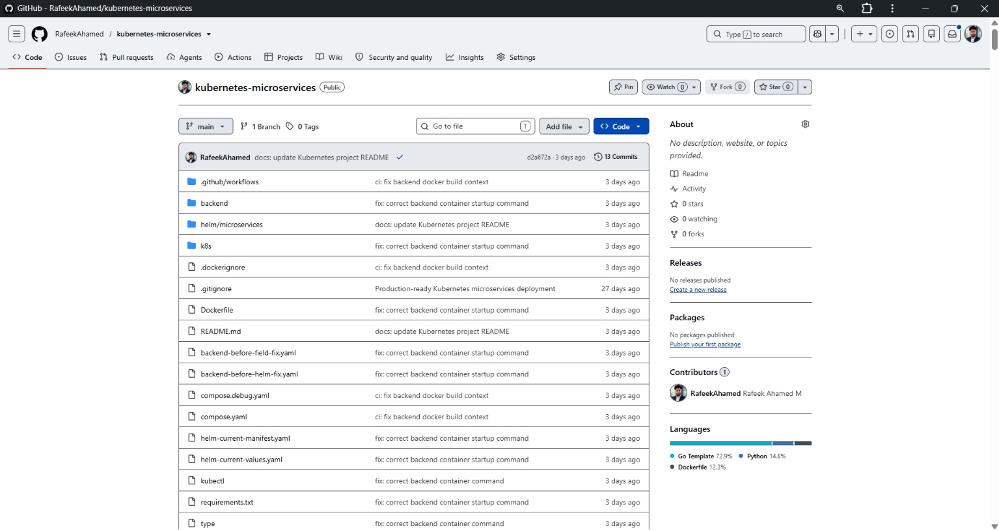
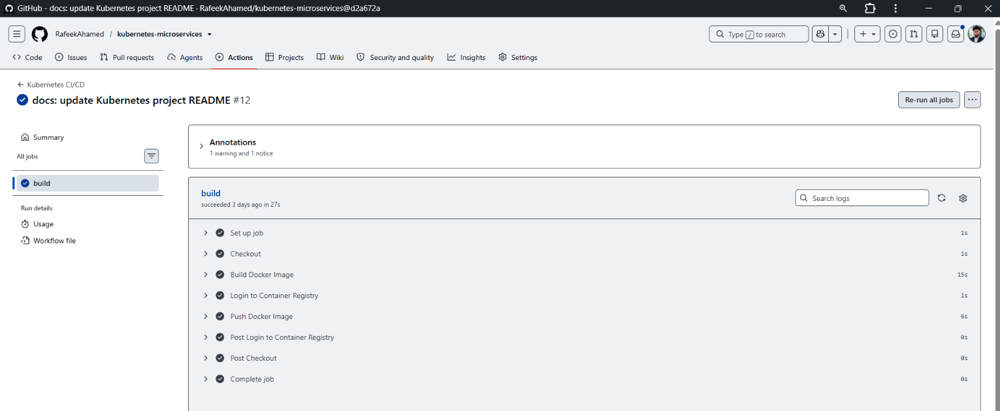
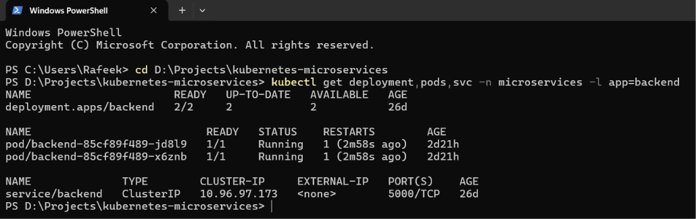
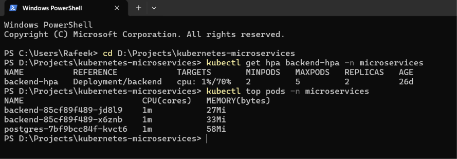
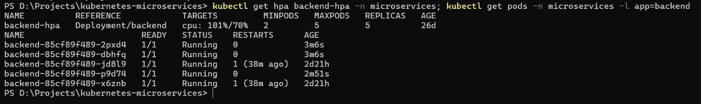
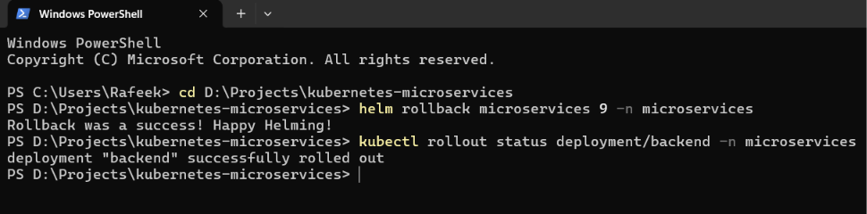

# Production-Ready Microservices Deployment & CI/CD Using Kubernetes

## 📌 Project Overview

This project demonstrates the deployment, scaling, health monitoring, troubleshooting, and release management of a containerized backend microservice on **Kubernetes**.

The project uses **Docker, Kubernetes, Helm, GitHub Actions, Docker Hub, PostgreSQL, RBAC, Ingress, ConfigMaps, Secrets, readiness/liveness probes, resource requests/limits, and Horizontal Pod Autoscaling**.

The project is intentionally implemented as a **pure Kubernetes environment without Azure/AKS**, focusing on practical Kubernetes and DevOps skills.

### Key capabilities demonstrated

- Docker containerization
- Kubernetes Deployments and Services
- Helm-based application packaging and release management
- Readiness and liveness probes
- CPU/memory resource requests and limits
- Horizontal Pod Autoscaling
- ConfigMaps and Secrets
- ServiceAccounts, Roles, and RoleBindings
- Ingress
- Rolling updates
- Helm upgrades and rollback
- GitHub Actions CI/CD
- Docker Hub image publishing
- Kubernetes troubleshooting and operational validation

---

# 🏗️ Architecture

```text
                        Developer
                            |
                            | git push
                            v
                    +---------------+
                    |    GitHub     |
                    |   Repository  |
                    +-------+-------+
                            |
                            v
                    +---------------+
                    | GitHub Actions|
                    | Build & Push  |
                    +-------+-------+
                            |
                            v
                    +---------------+
                    |   Docker Hub  |
                    | backend:<SHA> |
                    +-------+-------+
                            |
                            v
              +--------------------------------+
              |          Kubernetes            |
              |        microservices NS        |
              |                                |
              |  +--------------------------+  |
              |  | Ingress                  |  |
              |  | microservices.local      |  |
              |  +------------+-------------+  |
              |               |                |
              |               v                |
              |       +---------------+        |
              |       | Backend       |        |
              |       | Deployment    |        |
              |       | 2 - 5 replicas|        |
              |       +-------+-------+        |
              |               |                |
              |               v                |
              |       +---------------+        |
              |       | Backend       |        |
              |       | ClusterIP     |        |
              |       | :5000         |        |
              |       +---------------+        |
              |                                |
              |       +---------------+        |
              |       | PostgreSQL    |        |
              |       | Deployment    |        |
              |       +-------+-------+        |
              |               |                |
              |               v                |
              |       PostgreSQL :5432         |
              |                                |
              |       +---------------+        |
              |       | HPA           |        |
              |       | CPU target 70%|        |
              |       | min 2 / max 5 |        |
              |       +---------------+        |
              +--------------------------------+
```

---

# 🛠️ Technology Stack

| Technology | Purpose |
|---|---|
| Kubernetes | Container orchestration |
| Docker | Containerization |
| Helm | Kubernetes package/release management |
| GitHub Actions | CI/CD automation |
| Docker Hub | Container image registry |
| Python / Flask | Backend API |
| PostgreSQL | Database |
| YAML | Kubernetes and CI/CD configuration |
| Git / GitHub | Source control |
| kubectl | Kubernetes administration |
| Linux | Container/runtime environment |
| PowerShell | Local administration and troubleshooting |

---

# 📂 Project Structure

```text
kubernetes-microservices/
│
├── .github/
│   └── workflows/
│       └── kubernetes-ci-cd.yml
│
├── backend/
│   └── app.py
│
├── frontend/
│   └── ...
│
├── helm/
│   └── microservices/
│       ├── Chart.yaml
│       ├── values.yaml
│       ├── NOTES.txt
│       └── templates/
│           ├── deployment.yaml
│           ├── service.yaml
│           ├── hpa.yaml
│           ├── serviceaccount.yaml
│           └── test-connection.yaml
│
├── k8s/
│   ├── ...
│   └── ...
│
├── Dockerfile
├── requirements.txt
├── docker-compose.yml
└── README.md
```

> The current backend Dockerfile is located at the **repository root** and copies the application into `/app`.

---

# 🐳 Docker

## Build the backend image

From the repository root:

```powershell
docker build -t backend:test .
```

Run the container:

```powershell
docker run --rm -p 5000:5000 backend:test
```

Test the API:

```powershell
curl.exe http://localhost:5000
```

The container uses a non-root application user:

```dockerfile
USER appuser
```

The Dockerfile starts the Flask application with:

```dockerfile
CMD ["python", "backend/app.py"]
```

---

# ☸️ Kubernetes Deployment

The application runs inside the `microservices` namespace.

Create the namespace:

```powershell
kubectl create namespace microservices
```

Check:

```powershell
kubectl get namespace microservices
```

Deploy Kubernetes resources from the manifests when required:

```powershell
kubectl apply -f k8s/ -n microservices
```

Verify:

```powershell
kubectl get all -n microservices
```

---

# 🚀 Helm Deployment

The project uses Helm for versioned Kubernetes application management.

## Validate the chart

```powershell
helm lint helm\microservices
```

Expected:

```text
1 chart(s) linted, 0 chart(s) failed
```

## Render templates

```powershell
helm template microservices helm\microservices
```

## Install

```powershell
helm install microservices helm\microservices -n microservices --create-namespace
```

## Check release

```powershell
helm status microservices -n microservices
```

## List releases

```powershell
helm list -n microservices
```

---

# 📦 Backend Deployment

The Helm-managed backend Deployment uses:

```text
Replicas: 2
Container port: 5000
Service type: ClusterIP
CPU request: 100m
Memory request: 128Mi
CPU limit: 500m
Memory limit: 512Mi
```

Check the Deployment:

```powershell
kubectl get deployment backend -n microservices
```

Current verified state:

```text
NAME      READY   UP-TO-DATE   AVAILABLE
backend   2/2     2            2
```

Check backend pods:

```powershell
kubectl get pods -n microservices -l app=backend
```

---

# 🌐 Kubernetes Service

The backend is exposed internally through a ClusterIP Service:

```text
backend:5000
```

Check:

```powershell
kubectl get svc backend -n microservices
```

Current verified configuration:

```text
TYPE        PORT
ClusterIP   5000/TCP
```

---

# ❤️ Health Checks

The backend uses Kubernetes readiness and liveness probes.

```yaml
readinessProbe:
  httpGet:
    path: /health
    port: 5000
  initialDelaySeconds: 5
  periodSeconds: 10

livenessProbe:
  httpGet:
    path: /health
    port: 5000
  initialDelaySeconds: 15
  periodSeconds: 20
```

### Readiness Probe

Determines whether the application is ready to receive traffic.

### Liveness Probe

Allows Kubernetes to detect an unhealthy container and restart it when necessary.

Check pod details:

```powershell
kubectl describe pod -n microservices -l app=backend
```

View logs:

```powershell
kubectl logs -n microservices -l app=backend
```

---

# 📊 Resource Management

The backend Deployment defines resource requests and limits:

```yaml
resources:
  requests:
    cpu: "100m"
    memory: "128Mi"
  limits:
    cpu: "500m"
    memory: "512Mi"
```

This allows Kubernetes to make scheduling decisions based on requested resources and limits container resource consumption.

---

# 📈 Horizontal Pod Autoscaling

The backend uses `autoscaling/v2` HPA.

Configuration:

```text
Minimum replicas: 2
Maximum replicas: 5
Target CPU:       70%
```

Check:

```powershell
kubectl get hpa backend-hpa -n microservices
```

Expected healthy state:

```text
NAME          REFERENCE            TARGETS       MINPODS   MAXPODS   REPLICAS
backend-hpa   Deployment/backend   cpu: 1%/70%   2         5         2
```

Metrics:

```powershell
kubectl top pods -n microservices
```

---

## 🧪 HPA Validation

The HPA was tested under CPU load.

Observed behavior:

```text
Normal load
    |
    v
2 replicas
    |
    | CPU load increased
    v
5 replicas
    |
    | CPU load removed
    v
2 replicas
```

Verified scaling lifecycle:

```text
2 → 5 → 2
```

This demonstrates both HPA scale-up and scale-down behavior.

---

# 🔐 RBAC

The project uses Kubernetes Role-Based Access Control.

Components include:

- ServiceAccount
- Role
- RoleBinding

The `microservices` ServiceAccount is associated with a pod-reading Role.

Check:

```powershell
kubectl get serviceaccount -n microservices
kubectl get role -n microservices
kubectl get rolebinding -n microservices
```

Example RBAC relationship:

```text
ServiceAccount
      |
      v
RoleBinding
      |
      v
Role
      |
      v
Pod read permissions
```

---

# 🗂️ ConfigMap and Secrets

Application configuration can be supplied through Kubernetes ConfigMaps.

Check:

```powershell
kubectl get configmap -n microservices
```

Secrets:

```powershell
kubectl get secrets -n microservices
```

> Never commit real passwords, API keys, tokens, or credentials to GitHub. Use Kubernetes Secrets or an appropriate external secret-management solution for sensitive values.

---

# 🌐 Ingress

The project includes an Ingress route for:

```text
microservices.local
```

Check:

```powershell
kubectl get ingress -n microservices
```

The Ingress provides HTTP routing toward the application Service.

For local testing, configure the hostname according to the local Kubernetes/Ingress environment.

---

# 🗄️ PostgreSQL

PostgreSQL runs as a Kubernetes workload and is exposed internally through a Kubernetes Service.

Check:

```powershell
kubectl get deployment -n microservices
kubectl get svc -n microservices
```

PostgreSQL Service port:

```text
5432
```

The backend communicates with PostgreSQL through Kubernetes service discovery.

---

# 🔄 Rolling Updates

Kubernetes Deployments use rolling-update behavior to replace old Pods progressively.

Check rollout status:

```powershell
kubectl rollout status deployment/backend -n microservices
```

View rollout history:

```powershell
kubectl rollout history deployment/backend -n microservices
```

Restart the Deployment when required:

```powershell
kubectl rollout restart deployment/backend -n microservices
```

---

# 📦 Helm Release Management

Check Helm history:

```powershell
helm history microservices -n microservices
```

The project has been tested with multiple Helm revisions, including successful upgrades and rollback recovery.

---

# ⏪ Helm Rollback & Failure Recovery

A deliberate rollback test was performed to validate release recovery.

Recovery workflow:

```text
Known-good Helm release
          |
          v
Invalid image test
          |
          v
Helm rollback
          |
          v
Known-good configuration restored
          |
          v
Successful Kubernetes rollout
```

The known-good backend image is:

```text
rafeekahamed/backend:47ee97acd74492bd34209a6374f640a56676a3aa
```

The verified rollback created Helm revision **11**:

```text
STATUS:      deployed
REVISION:    11
DESCRIPTION: Rollback to 9
```

After rollback:

```text
Backend Deployment: 2/2
Backend Pods:       Running
Rollout:             Successful
```

Verify:

```powershell
kubectl get deployment backend -n microservices
kubectl get pods -n microservices -l app=backend
```

Verify the active image:

```powershell
kubectl get deployment backend -n microservices -o jsonpath="{.spec.template.spec.containers[0].image}"
```

---

# 🧪 Helm Test

The chart contains a Helm test hook for backend connectivity.

Run:

```powershell
helm test microservices -n microservices
```

Verified result:

```text
TEST SUITE: microservices-test-connection
Phase: Succeeded
```

This validates that the Helm test Pod can reach the backend Service.

---

# 🔁 CI/CD with GitHub Actions

The GitHub Actions workflow automates the backend container image build and registry publishing process.

Current workflow:

```text
Git Push
   |
   v
Checkout source
   |
   v
Build Docker image
   |
   v
Authenticate with Docker Hub
   |
   v
Tag image with Git commit SHA
   |
   v
Push image to Docker Hub
```

The current workflow uses:

```yaml
docker build -t backend:${{ github.sha }} .
```

The image is then published as:

```text
rafeekahamed/backend:<commit-sha>
```

Example verified image:

```text
rafeekahamed/backend:47ee97acd74492bd34209a6374f640a56676a3aa
```

### Important

The current GitHub Actions workflow **builds and pushes the backend image**. Kubernetes deployment is currently managed locally through Helm rather than directly from the GitHub-hosted runner.

This keeps the documentation aligned with the actual implemented pipeline.

---

# 🔒 GitHub Actions Secrets

The workflow uses repository secrets:

```text
REGISTRY_URL
REGISTRY_USERNAME
REGISTRY_PASSWORD
```

`REGISTRY_PASSWORD` should contain a Docker Hub Access Token.

Never commit credentials directly into workflow files.

---

# 🔍 Kubernetes Troubleshooting

## Check Pods

```powershell
kubectl get pods -n microservices
```

## Check Backend Pods

```powershell
kubectl get pods -n microservices -l app=backend
```

## Check Services

```powershell
kubectl get svc -n microservices
```

## Check Deployments

```powershell
kubectl get deployments -n microservices
```

## Check HPA

```powershell
kubectl get hpa -n microservices
```

## Check Metrics

```powershell
kubectl top pods -n microservices
kubectl top nodes
```

## View Logs

```powershell
kubectl logs <pod-name> -n microservices
```

## Follow Logs

```powershell
kubectl logs -f <pod-name> -n microservices
```

## Describe Pod

```powershell
kubectl describe pod <pod-name> -n microservices
```

## Describe Deployment

```powershell
kubectl describe deployment backend -n microservices
```

## Check Events

```powershell
kubectl get events -n microservices --sort-by=.lastTimestamp
```

## Check Service

```powershell
kubectl describe svc backend -n microservices
```

---

# 🧰 Metrics Server

HPA depends on Kubernetes resource metrics.

Check:

```powershell
kubectl top pods -n microservices
```

For Minikube:

```powershell
minikube addons enable metrics-server
```

Then:

```powershell
kubectl top pods -n microservices
```

The HPA should be validated only after resource metrics are available.

---

# 🧪 Application and Infrastructure Validation

Useful verification commands:

```powershell
kubectl get all -n microservices
```

```powershell
kubectl get pods -n microservices -o wide
```

```powershell
kubectl get svc -n microservices
```

```powershell
kubectl get ingress -n microservices
```

```powershell
kubectl get hpa -n microservices
```

```powershell
helm status microservices -n microservices
```

```powershell
helm test microservices -n microservices
```

---

# 📊 Verified Project Results

| Capability | Status |
|---|---|
| Docker image build | ✅ |
| Docker Hub image push | ✅ |
| GitHub Actions CI workflow | ✅ |
| Kubernetes Deployment | ✅ |
| Kubernetes Service | ✅ |
| Helm chart lint | ✅ |
| Helm deployment | ✅ |
| Helm upgrade | ✅ |
| Helm rollback | ✅ |
| Helm test | ✅ |
| Readiness probe | ✅ |
| Liveness probe | ✅ |
| Resource requests/limits | ✅ |
| HPA scale-up | ✅ |
| HPA scale-down (`5 → 2`) | ✅ |
| HPA lifecycle `2 → 5 → 2` | ✅ |
| RBAC | ✅ |
| Ingress | ✅ |
| PostgreSQL | ✅ |
| Rolling rollout | ✅ |
| Failure recovery | ✅ |

---

# 🎯 DevOps & Kubernetes Skills Demonstrated

### Kubernetes

- Pods
- Deployments
- ReplicaSets
- Services
- Namespaces
- ConfigMaps
- Secrets
- ServiceAccounts
- RBAC
- Ingress
- Resource requests and limits
- Readiness probes
- Liveness probes
- HPA
- Rolling updates
- Rollbacks

### Helm

- Chart structure
- `values.yaml`
- Templates
- Release management
- Upgrade
- Rollback
- Release history
- Helm test hooks
- Chart linting
- Template rendering

### Docker

- Dockerfile
- Image builds
- Non-root containers
- Container testing
- Docker Hub publishing
- Git SHA image tagging

### CI/CD

- GitHub Actions
- Automated Docker builds
- Registry authentication
- Immutable image tags
- Docker image publishing

### Troubleshooting

- `kubectl logs`
- `kubectl describe`
- Kubernetes Events
- `kubectl top`
- HPA troubleshooting
- Image pull troubleshooting
- Deployment rollout troubleshooting
- Helm release troubleshooting

---

# 💼 Resume / Portfolio Highlights

**Production-Ready Microservices Deployment & CI/CD Using Kubernetes**

- Containerized a Flask backend using Docker and deployed it on Kubernetes with Deployments, Services, ConfigMaps, Secrets, health probes, and resource controls.
- Built and maintained a reusable Helm chart for Kubernetes release management, including configurable images, Services, HPA, ServiceAccount, health probes, and Helm test hooks.
- Implemented and validated CPU-based HPA scaling from **2 → 5 → 2 replicas** under controlled load.
- Automated Docker image build and Docker Hub publishing through GitHub Actions using Git commit SHA-based image versioning.
- Implemented RBAC, Ingress, rolling updates, release history, and rollback-based recovery.
- Performed a deliberate invalid-image rollback test and successfully restored the known-good application release.
- Used `kubectl`, Helm, logs, metrics, rollout status, and Kubernetes events for deployment troubleshooting and operational validation.

---

# 📌 Project Outcomes

The project demonstrates practical experience in:

```text
Containerization
      ↓
Kubernetes Deployment
      ↓
Service Discovery
      ↓
Health Monitoring
      ↓
Autoscaling
      ↓
Helm Release Management
      ↓
CI/CD Image Publishing
      ↓
Rollback & Recovery
```

---

---

# 📸 Project Screenshots

The screenshots below provide evidence of the repository, CI image publishing, Kubernetes deployment, autoscaling, Helm release management, rollback recovery, and application validation.

The following screenshots provide visual evidence of the implemented Kubernetes, Helm, CI/CD, autoscaling, rollback, and application-validation workflows.

## GitHub Repository



## GitHub Actions CI/CD



## Kubernetes Deployment



## HPA — Normal State



## HPA — Scale Up

The backend HPA was validated under controlled CPU load, scaling from **2 to 5 replicas** when CPU utilization exceeded the configured **70% target**.



## HPA — Scale Down

After the controlled CPU load was removed, the backend HPA returned to the configured minimum of **2 replicas**.

Verified state:

```text
NAME          REFERENCE            TARGETS       MINPODS   MAXPODS   REPLICAS
backend-hpa   Deployment/backend   cpu: 1%/70%   2         5         2
```

This completes the validated HPA lifecycle: **2 → 5 → 2 replicas**.

## Helm Release


## Helm Test


## Helm Rollback & Recovery



## Backend Port Forward


## Backend API Response


# 👨‍💻 Author

**Rafeek Ahamed M**

**DevOps Engineer | Azure Cloud Engineer**

GitHub:  
https://github.com/RafeekAhamed

LinkedIn:  
https://linkedin.com/in/rafeek-ahamed-devops

---

## ⭐ Project Focus

**Kubernetes • Docker • Helm • GitHub Actions • CI/CD • HPA • RBAC • Ingress • PostgreSQL • Linux • YAML**
